# Architecture Diagram Prompt: GHA AWS OIDC Bootstrap

## Context
This project automates the setup of AWS IAM roles and OIDC trust for GitHub Actions, using Python 3.11, Bash, and AWS CloudFormation. It enables secure, short-lived AWS credentials for GitHub workflows across multiple repositories, with all permissions and trust policies managed as code.

## Required Diagram
Generate a diagram that clearly shows the following components and their relationships:

- **GitHub Actions Workflow** (triggered in any allowed repository)
- **GitHub OIDC Token Service** (`token.actions.githubusercontent.com`)
- **AWS IAM OIDC Identity Provider** (created/discovered by automation)
- **AWS IAM Role** (created by CloudFormation, trust policy allows OIDC from GitHub)
- **IAM Policies** (inlined from `policies/` directory)
- **CloudFormation Stack** (manages IAM resources)
- **Bash/Python Automation** (`run.sh`, `src/cfn_deploy.py`)

### Data Flows
- Show the OIDC authentication flow from GitHub Actions to AWS.
- Show how the setup scripts automate provider/role/policy creation and updates.
- Indicate where repo variables (e.g., `GHA_OIDC_ROLE_ARN`) are set in GitHub.

## Architecture Diagram

```mermaid
flowchart LR
    %% GitHub Layer
    subgraph GH["GitHub 🐙"]
        GH_Workflow["<b>GitHub Actions Workflow</b>\n<code>main.yml</code>"]
        OIDC_Token["<b>OIDC Token Service</b>\n<code>token.actions.githubusercontent.com</code>"]
    end

    %% AWS Layer
    subgraph AWS["AWS ☁️"]
        OIDC_Provider["<b>IAM OIDC Identity Provider</b>\n<code>aws_iam_oidc_provider</code>"]
        CFN_Stack["<b>CloudFormation Stack</b>\n<code>cfn_deploy.py</code>"]
        IAM_Role["<b>AWS IAM Role</b>\n(trusts GitHub OIDC)"]
        IAM_Policies["<b>IAM Policies</b>\n(from <code>policies/</code> dir)"]
    end

    Automation["<b>Automation Scripts</b>\n<code>run.sh</code>, <code>src/cfn_deploy.py</code>"]

    %% Flows
    GH_Workflow -- "Requests OIDC Token" --> OIDC_Token
    OIDC_Token -- "Presents OIDC Token" --> OIDC_Provider
    Automation -- "Deploys/Updates" --> CFN_Stack
    CFN_Stack -- "Creates/Manages" --> OIDC_Provider
    CFN_Stack -- "Creates/Manages" --> IAM_Role
    CFN_Stack -- "Attaches" --> IAM_Policies
    OIDC_Provider -- "Trust Relationship" --> IAM_Role
    GH_Workflow -- "Assume Role via OIDC" --> IAM_Role
    Automation -- "Sets repo variable\n(<code>GHA_OIDC_ROLE_ARN</code>)" --> GH_Workflow
```

## Diagram Style
- Use AWS and GitHub icons where possible.
- Prefer a layered, left-to-right or top-down flow.
- Label all components and flows clearly.

---

*Generated: 2025-04-23. Update this prompt as the architecture evolves.*
